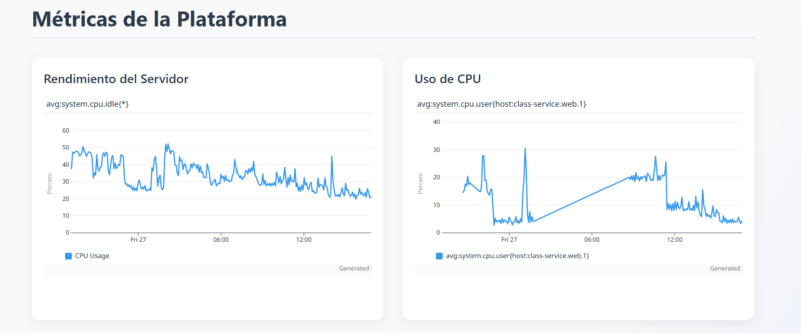
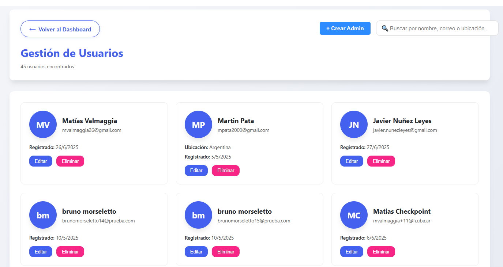
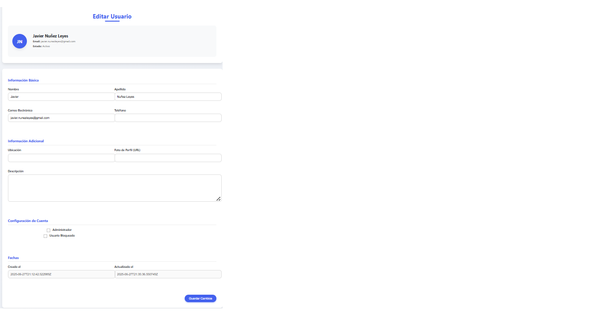
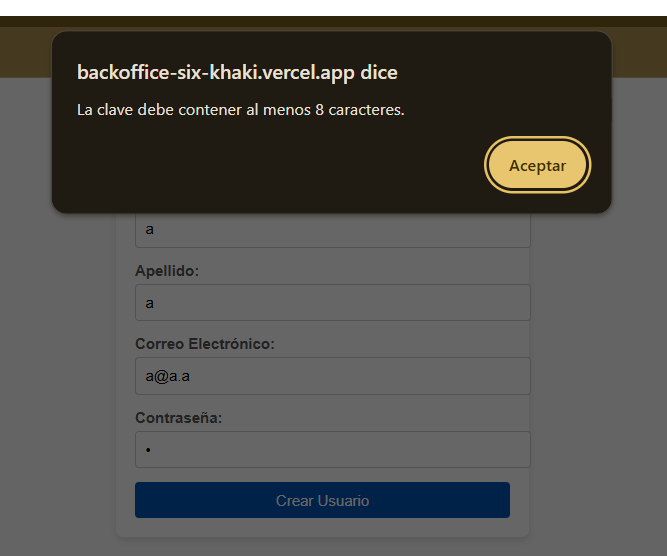

Guía de Usuario del Backoffice

¡Bienvenido a la guía de usuario de nuestro Backoffice! Esta herramienta está diseñada para que los administradores gestionen de forma eficiente las métricas del sistema, los usuarios y las reglas de la plataforma, garantizando un control completo y seguro de la plataforma.

1. Monitoreo de Actividad y Rendimiento

La sección de Monitoreo de Actividad y Rendimiento es tu centro de comando para observar la salud y el desempeño de la plataforma en tiempo real. Esto te permite detectar problemas, optimizar recursos y asegurar que todos los servicios operen de manera óptima.

Visualización de Indicadores Clave

Al acceder a esta sección, el sistema te mostrará dashboards actualizados en tiempo real con los siguientes indicadores clave:

    Uso de CPU: Observa el porcentaje de utilización del procesador de tus servidores. Picos o sostenimiento alto pueden indicar una demanda considerable o procesos ineficientes.

    Memoria: Monitorea el consumo de RAM. Un uso elevado constante podría señalar fugas de memoria o la necesidad de más recursos.

    Número de Usuarios Activos: Visualiza la cantidad de usuarios que están interactuando con la plataforma en ese momento, brindando una idea de la carga actual.

    Tiempo de Respuesta: Revisa la latencia de los servicios. Tiempos de respuesta altos pueden indicar problemas de rendimiento que afectan la experiencia del usuario.

Registro y Acceso a Logs

Cuando se produce cualquier evento relevante en la plataforma (errores, advertencias, acciones críticas), el sistema los registrará automáticamente. Podrás acceder a logs detallados para un análisis profundo, lo cual es fundamental para el diagnóstico y la resolución de problemas.

Configuración de Alertas y Notificaciones

Reportes Históricos y Exportación

Si necesitas analizar el rendimiento a lo largo del tiempo, el sistema te permite generar reportes históricos de las métricas.

2. Gestión de Usuarios y Permisos

La sección de Gestión de Usuarios y Permisos te permite controlar y administrar a todos los usuarios de la plataforma, asignando roles y permisos adecuados para garantizar la seguridad y una administración eficiente.

Visualización del Listado de Usuarios

Cuando accedas a esta sección, el sistema te mostrará una lista completa de los usuarios registrados. Esta lista incluirá información relevante para cada usuario, como:

    Nombre: El nombre de identificación del usuario.

    Rol: El rol actual del usuario dentro de la plataforma (por ejemplo, usuario regular, administrador, etc.).

    Estado: Si el usuario está activo (puede iniciar sesión) o bloqueado (su acceso está restringido).

    Fecha de Registro: La fecha en que el usuario se unió a la plataforma.

    Y demas datos pertinentes al estudiante

Edición de Roles y Permisos

Para modificar los permisos de un usuario:

    Seleccioná el usuario de la lista cuyo perfil deseas modificar.

    El sistema te permitirá actualizar los datos de susd permisos.

    Una vez guardados los cambios, estos se reflejarán de forma inmediata y recibirás una confirmación de la actualización.

Bloqueo y Desbloqueo de Usuarios

Si necesitas gestionar el acceso de un usuario:

    Seleccioná el usuario que deseas bloquear o desbloquear.

    El sistema cambiará el estado del usuario en consecuencia:

        Si lo bloqueas, se impedirá su acceso a la plataforma.

        Si lo desbloqueas, su acceso será restaurado.

Validación de Acciones

El sistema está diseñado para validar las operaciones de modificación de permisos o roles. Si intentas realizar una acción que podría generar conflictos o errores (por ejemplo, datos inválidos o permisos insuficientes), el sistema te mostrará mensajes de error claros para guiarte.

Registro de Administradores

Como administrador, puedes dar de alta a otros administradores en la plataforma.

    Registro Exitoso: Si el registro se realiza correctamente, el sistema registrará el nuevo administrador con sus credenciales y permitirá su ingreso.

    Campos Faltantes/Erróneos: Si falta información o hay datos incorrectos, el sistema te indicará los campos a corregir y no permitirá el registro hasta que los datos sean válidos.

    Registro Fallido: En caso de un error del servicio, el sistema mostrará un mensaje de error acorde al usuario.

3. Configuración de Reglas y Normativas

La sección de Configuración de Reglas y Normativas te permite definir y actualizar las políticas, restricciones y lineamientos de comportamiento que rigen el uso de la plataforma. Esto es vital para garantizar un entorno seguro y el cumplimiento de estándares institucionales y legales.

Creación y Actualización de Reglas

Al acceder a esta sección, el sistema te permitirá:

    Crear nuevas reglas: Podrás definir nuevas normativas para la plataforma.

    Actualizar reglas existentes: Podrás modificar las reglas ya establecidas.

Para cada regla, podrás configurar campos como:

    Título: Un nombre descriptivo para la regla.

    Descripción: Un detalle de lo que la regla implica.

    Fecha de Vigencia: El período en el que la regla estará activa.

    Condiciones de Aplicación: Los criterios específicos bajo los cuales la regla se activará o aplicará.

Validación y Consistencia

Cuando ingreses nuevas reglas o actualices las existentes, el sistema validará que los datos sean correctos y consistentes. Si la información está incompleta o es inconsistente, se mostrarán mensajes de error claros para que puedas corregirlos antes de guardar.

Publicación y Notificación

Una vez que finalices la configuración de las reglas:

    El sistema publicará las normativas actualizadas en la plataforma.

Registro de Auditoría de Cambios

Toda modificación realizada en las reglas y normativas se registrará en un log de auditoría. Este log incluirá:

    El usuario que realizó el cambio: Quién modificó la regla.

    La naturaleza de la modificación: Qué tipo de cambio se hizo (creación, edición, eliminación).

    La fecha y hora de la acción.

Acceso Restringido y Seguridad

La sección de configuración de reglas es de alta seguridad. El sistema garantizará que solo los usuarios debidamente autorizados puedan realizar cambios, protegiendo la integridad y confidencialidad de las normativas de la plataforma.
